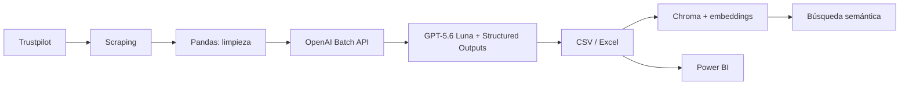

# Análisis profesional de reseñas con OpenAI GPT‑5.6 y Chroma

[](https://www.python.org/) [](https://platform.openai.com/) [](https://www.trychroma.com/) [](https://pandas.pydata.org/) [](https://streamlit.io/) [](https://powerbi.microsoft.com/)

Pipeline reproducible para extraer reseñas, normalizarlas, clasificarlas con
salidas estructuradas y almacenarlas en Chroma para búsqueda semántica. Los
resultados también se conservan en CSV/Excel para Power BI.

## Por qué este proyecto es relevante

Clasificar reseñas con un modelo de lenguaje es relativamente sencillo. El reto
real aparece cuando el análisis debe ejecutarse de forma repetible sobre grandes
volúmenes, con costos controlados, resultados consistentes y suficiente
trazabilidad para que las salidas puedan utilizarse en análisis posteriores.

Este proyecto busca resolver ese problema mediante una arquitectura que combina:

- procesamiento asíncrono de alto volumen con OpenAI Batch API;
- selección de un modelo adecuado para clasificación repetitiva;
- salidas estructuradas y validación explícita de la taxonomía;
- persistencia tabular para análisis en Excel o Power BI;
- almacenamiento vectorial para búsqueda semántica;
- pruebas automatizadas, configuración reproducible e idempotencia.

El objetivo no es únicamente demostrar que un LLM puede identificar sentimiento.
La intención es mostrar cómo un mismo problema analítico puede rediseñarse para
mejorar escalabilidad, mantenibilidad, reproducibilidad y costo de inferencia sin
perder el control sobre la calidad de la clasificación.

## Evolución del proyecto

Este repositorio es la evolución de
[`franciscogonzalez-gal/investigacion_data_science`](https://github.com/franciscogonzalez-gal/investigacion_data_science),
un proyecto anterior que implementaba un flujo completo desde la extracción de
reseñas hasta su clasificación con GPT-5, almacenamiento en BigQuery y
visualización en Power BI.

La versión actual conserva el problema de negocio original, pero rediseña la capa
de IA y la arquitectura de datos para reducir costo, mejorar la validación y
facilitar la reutilización del pipeline.

| Aspecto | Repositorio original | Repositorio actual |
|---|---|---|
| Modelo de clasificación | GPT-5 | GPT-5.6 Luna por defecto |
| Modo de ejecución | Responses API síncrona, una llamada por reseña | Batch API para producción y modo síncrono para pruebas |
| Formato de salida | JSON interpretado mediante parsing y fallbacks | Structured Outputs con esquema Pydantic |
| Validación | Campos obligatorios y revisión posterior | Contrato estricto más validación de coherencia entre polaridad y taxonomía |
| Almacenamiento analítico | BigQuery y archivos tabulares | CSV/Excel para BI y Chroma para búsqueda semántica |
| Recuperación de información | Exploración tabular | Exploración tabular más búsqueda vectorial |
| Reprocesamiento | Flujo lineal | Upserts idempotentes e identificadores estables |
| Calidad de software | Validaciones dentro del flujo | Pruebas automatizadas, Pytest y Ruff |

### Ahorro estimado de inferencia

Suponiendo igualdad en la cantidad de tokens de entrada y salida, y comparando el
modelo original con GPT-5.6 Luna procesado mediante Batch API, el costo relativo
queda así:

| Componente | Repositorio original | Repositorio actual | Reducción |
|---|---:|---:|---:|
| Tokens de entrada | 100% | 40% | 60% |
| Tokens de salida | 100% | 30% | 70% |
| Costo total de inferencia | 100% | 31.1% | **68.9%** |

La reducción proviene de dos decisiones combinadas: utilizar un modelo más
adecuado para clasificación repetitiva y aprovechar el descuento del 50% de la
Batch API. El costo adicional de `text-embedding-3-small` para indexación
vectorial es marginal frente al costo de clasificación y agrega una capacidad
que no existía en el repositorio original.

Los porcentajes son una comparación relativa bajo igualdad de tokens. El costo
real de una ejecución también depende de la longitud del prompt, la longitud de
las reseñas, los tokens generados, los reintentos y el modelo configurado.

## Arquitectura



Decisiones principales:

- `gpt-5.6-luna` para clasificación de alto volumen; puede cambiarse a
  `gpt-5.6-terra` o `gpt-5.6-sol` mediante configuración.
- Batch API como modo de producción y Responses API síncrona para pruebas.
- Structured Outputs con Pydantic: la API aplica el esquema y el código valida
  además la coherencia entre polaridad y taxonomía.
- `store=False` para no conservar respuestas del clasificador en OpenAI.
- Chroma persistente local para desarrollo; `HttpClient` para un servidor de
  producción.
- `text-embedding-3-small` por defecto: es un modelo de embeddings, no un LLM,
  y es más apropiado que GPT‑5.6 para indexación vectorial.
- Upserts idempotentes y embeddings enviados por grupos.

## Instalación con Conda

```powershell
conda env create -f environment.yml
conda activate sentiment-analysis
playwright install chromium
```

La instalación de Chromium solo hace falta si se usa `--playwright`.

## Panel de análisis

El panel Streamlit combina las clasificaciones tabulares con la búsqueda
semántica persistida en Chroma. Usa por defecto
`output/resenas_clasificadas.xlsx` y permite seleccionar otro CSV o Excel
clasificado desde la barra lateral.

```powershell
conda run -n sentiment-analysis streamlit run dashboard.py
```

Incluye filtros por empresa, sentimiento, categoría, valoración y periodo;
comparativas Plotly; detalle de reseñas; y una consulta semántica a Chroma
restringida por los filtros activos. La búsqueda necesita la misma
configuración de Chroma y `OPENAI_API_KEY` que el pipeline.

## Informe de Power BI

El informe publicado en Power BI presenta el análisis tabular generado por el
pipeline. Está disponible en [Análisis de sentimiento de reseñas](https://app.powerbi.com/view?r=eyJrIjoiNWJkOGU4NGYtY2E3MS00MDhkLWJiYjItMjZiZjY3NzQ0N2M3IiwidCI6IjVkMjFhNmQ1LWIzODMtNGUxMi1hYjFiLTY3YTUxNWZmM2RhOCIsImMiOjR9).

El proyecto editable está incluido como `Tablero Sentiment Analysis.pbip` y
consume las salidas clasificadas del pipeline para actualizar las visualizaciones.

Copiar la configuración de ejemplo y conservar la clave existente:

```powershell
Copy-Item .env.example .env.local
```

No sobrescribas tu `.env` actual. Tanto `.env` como `.env.local` están
ignorados por Git.

## Uso recomendado: Batch API

El flujo de producción tiene dos fases porque OpenAI procesa los lotes de forma
asíncrona.

### Empezar desde reseñas ya consolidadas

Si ya existe `output/resenas_combinadas.csv`, se puede omitir la lectura de
empresas, el scraping y la consolidación:

```powershell
conda run -n sentiment-analysis python run_pipeline.py --from-combined-csv "output\resenas_combinadas.csv"
```

El comando usa Batch API de forma predeterminada. Cuando termine:

```powershell
conda run -n sentiment-analysis python run_pipeline.py --finalize-batch
```

Para procesar inmediatamente sin Batch:

```powershell
conda run -n sentiment-analysis python run_pipeline.py --from-combined-csv output/resenas_combinadas.csv --llm-mode sync
```

### 1. Extraer, procesar y enviar el lote

```powershell
conda run -n sentiment-analysis python run_pipeline.py --empresas-xlsx Empresas.xlsx --playwright
```

El ID y el estado quedan en `output/openai_batch_state.json`. Cada solicitud
del JSONL tiene un `custom_id` estable y el lote usa `/v1/responses`.

### 2. Consultar el estado

```powershell
conda run -n sentiment-analysis python llm_parse.py --mode batch-status
```

### 3. Descargar resultados y cargarlos a Chroma

```powershell
conda run -n sentiment-analysis python run_pipeline.py --finalize-batch
```

Si el lote aún no terminó, el comando informa el estado y no modifica Chroma.
Al finalizar se generan:

- `output/resenas_clasificadas.csv`
- `output/resenas_clasificadas.xlsx`
- `chroma_data/` con la colección vectorial local

## Prueba rápida síncrona

Procesa tres reseñas por empresa mediante Responses API y las inserta en Chroma:

```powershell
conda run -n sentiment-analysis python run_pipeline.py --test-mode
```

Para ejecutar todo el volumen de forma síncrona:

```powershell
conda run -n sentiment-analysis python run_pipeline.py --llm-mode sync
```

## Operaciones con Chroma

Cargar o actualizar un archivo clasificado:

```powershell
conda run -n sentiment-analysis python chroma_store.py load --input output/resenas_clasificadas.xlsx
```

Búsqueda semántica:

```powershell
conda run -n sentiment-analysis python chroma_store.py query "paquetes que nunca llegaron" --limit 10
```

Filtrar por metadatos:

```powershell
conda run -n sentiment-analysis python chroma_store.py query "mala comunicación" --where '{"sentiment_label":"Negativa"}'
```

Estadísticas y exportación para BI:

```powershell
conda run -n sentiment-analysis python chroma_store.py stats
conda run -n sentiment-analysis python chroma_store.py export --output output/chroma_export.xlsx
```

Para producción, iniciar Chroma como servicio y definir `CHROMA_HOST`,
`CHROMA_PORT` y `CHROMA_SSL`. La aplicación cambia automáticamente de
`PersistentClient` a `HttpClient`.

## Configuración

Consulta [.env.example](.env.example). Las variables más importantes son:

| Variable | Predeterminado | Uso |
|---|---|---|
| `OPENAI_CLASSIFICATION_MODEL` | `gpt-5.6-luna` | Modelo del clasificador |
| `OPENAI_REASONING_EFFORT` | `none` | Esfuerzo para clasificación |
| `OPENAI_EMBEDDING_MODEL` | `text-embedding-3-small` | Vectores de Chroma |
| `CHROMA_PATH` | `chroma_data` | Persistencia local |
| `CHROMA_COLLECTION` | `customer_reviews` | Colección |
| `CHROMA_UPSERT_BATCH_SIZE` | `100` | Documentos por upsert |

Usa Sol selectivamente cuando una evaluación demuestre que la calidad adicional
compensa el coste y la latencia:

```powershell
$env:OPENAI_CLASSIFICATION_MODEL = "gpt-5.6-sol"
$env:OPENAI_REASONING_EFFORT = "low"
```

## Estructura relevante

```text
run_pipeline.py              Orquestación end-to-end y ciclo Batch
llm_parse.py                 Responses API, Batch API y esquema Pydantic
llm_parse_system_prompt.md   Taxonomía e instrucciones de clasificación
chroma_store.py              Upsert, consulta y exportación de Chroma
procesado_resenas.py         Consolidación y limpieza
web_scrapping.py             Extracción de reseñas
tests/                       Pruebas sin llamadas externas
environment.yml              Entorno Conda mínimo y reproducible
pyproject.toml               Configuración de pytest y Ruff
```

BigQuery y sus dependencias se retiraron del código. Chroma cumple la función de
almacén semántico; CSV/Excel sigue siendo la interfaz tabular para Power BI.

## Calidad y seguridad

```powershell
conda run -n sentiment-analysis pytest
conda run -n sentiment-analysis ruff check .
```

- Nunca versiones `.env`, credenciales JSON, `chroma_data/` ni salidas.
- El antiguo archivo de credenciales de Google está ignorado, pero conviene
  revocar esa clave en Google Cloud si alguna vez se publicó.
- Respeta `robots.txt`, los términos de Trustpilot y la normativa aplicable.
- Antes de cambiar modelo, esfuerzo o taxonomía, evalúa una muestra etiquetada y
  compara precisión, coste, latencia y tasa de errores.

## Autor

Francisco Gonzalez.

Consulta `LICENSE` para los términos del proyecto.